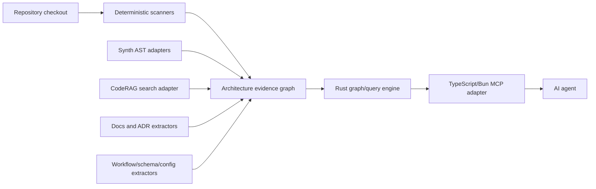

# Architecture

Architecture Reader MCP builds a local architecture evidence graph and serves it
through MCP tools optimized for AI agents.

## System Shape

## Main Components

### TypeScript/Bun MCP Adapter

Owns MCP protocol integration, tool schemas, request validation, adapter wiring
to existing Sylphx TypeScript packages, and response shaping for agents. It is a
thin boundary and should not own graph algorithms or long-term storage formats.

### Rust Core Engine

Owns the architecture graph model, graph traversal, query planning, ranking,
impact analysis, cache keying, index validation, and storage abstraction. The
engine must remain usable without MCP so CLI, CI, or future service adapters can
reuse it.

### Extractor Adapters

Extractors are versioned adapters that convert repository evidence into graph
nodes, edges, and claims. Initial adapters:

- Manifest extractor: package metadata, workspaces, Cargo, Python, Go, Java.
- Synth AST extractor: symbols, spans, imports, exports, syntax evidence.
- CodeRAG adapter: optional fallback for generic chunk retrieval.
- Docs/ADR extractor: decisions, documented boundaries, concepts, references.
- Workflow/config extractor: CI, deployment, routing, schemas, infrastructure.

Adapters must emit provenance and uncertainty. They must not silently promote LLM
inference to deterministic evidence.

## Data Flow

1. Resolve the repository root and git commit.
2. Read ignore rules and skip generated/vendor folders by default.
3. Scan manifests, docs, configs, workflows, schemas, and source files.
4. Parse supported source files with Synth or a future Rust parser adapter.
5. Normalize extracted facts into the evidence graph.
6. Build indexes for graph traversal, lexical lookup, structural filters, and
   optional semantic retrieval.
7. Serve agent queries through MCP with answer envelopes and evidence refs.

## Query Model

Architecture answers are not raw search results. Query execution has four
layers:

1. Intent classification: overview, search, trace, impact, evidence lookup.
2. Candidate retrieval: graph filters, lexical search, symbol search, optional
   CodeRAG or vector retrieval.
3. Evidence assembly: collect nodes, edges, paths, file spans, and conflicts.
4. Answer shaping: compact response, citations, confidence, gaps, next probes.

## Storage Model

The initial storage target is local and deterministic:

- graph snapshot keyed by repository root and git commit;
- extractor version metadata;
- file content hashes;
- per-node and per-edge evidence references;
- query indexes derived from the graph.

Storage must support full rebuild, incremental refresh, and stale-index
reporting. The exact backend is an engine detail; SQLite, sled, Tantivy, or a
custom file format can be evaluated after the graph model tests exist.

## Freshness And Trust

Every tool response includes:

- indexed git commit;
- current git commit when available;
- freshness status: `fresh`, `stale`, `dirty`, or `unknown`;
- extraction coverage;
- deterministic vs inferred evidence counts;
- gaps that affect the answer.

## Relationship To Existing Repositories

- Synth owns parser contracts and language parser packages.
- `SylphxAI/ast` owns ANTLR/TypeScript AST parsing tools currently centered on
  JavaScript.
- CodeRAG owns generic code chunk indexing and search.
- Reader MCP repositories own media/document reading.
- Architecture Reader MCP owns architecture-level graph and agent answer
  contracts.
